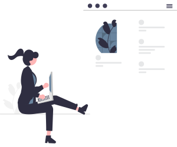

  
# 🌸 Flower Dev

### 🚀 Frontend Developer | France 🇫🇷

## 👋 About Me

Passionate frontend developer with 4 years of experience in software and web interface development. I specialize in digital and artistic innovation, with particular expertise in SaaS products, media players, and Design Systems. I'm accustomed to working in team environments using agile methodologies.

## 🛠️  Technical Stack
  
### 💻 Frontend Development

  
  
  
  
  
  
  
  
  
  

### 🛠️ Development Tools

  
  
  
  
  

## 📫 Connect With Me

  
  
  

